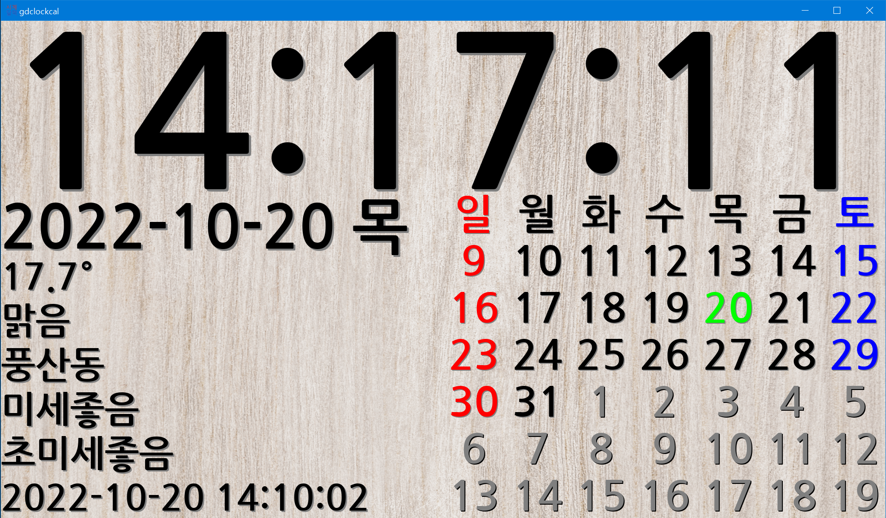
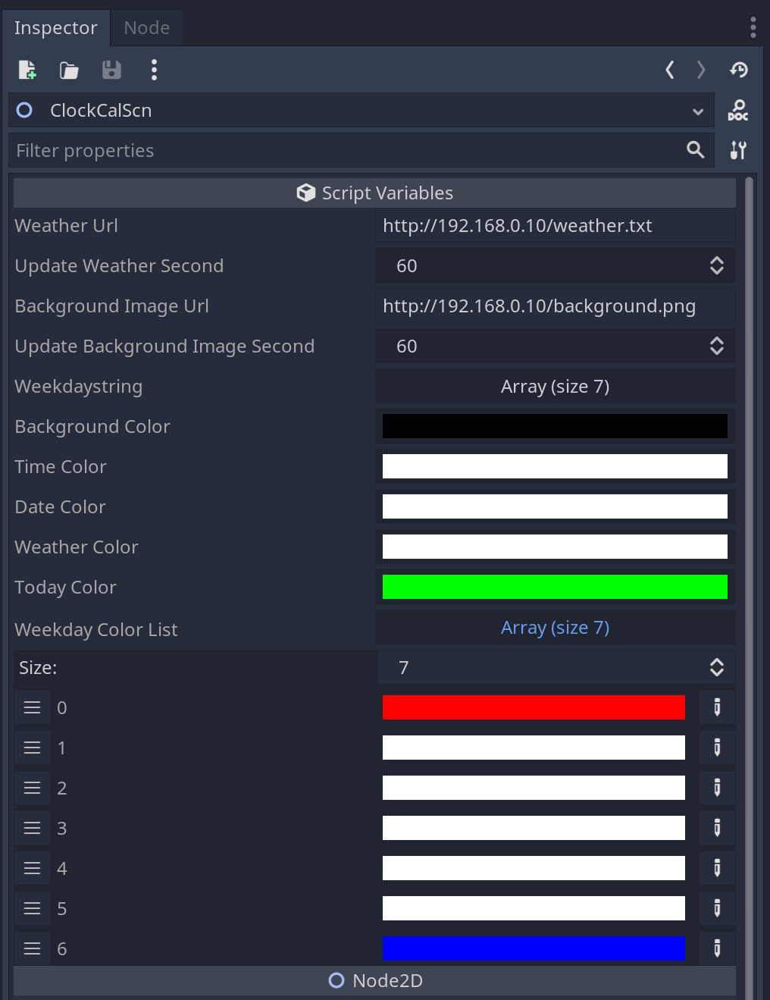

# clock calendar and weather by godot engine

# godot 게임 엔진으로 만든 시계, 달력, 날씨 프로그램 

날씨 업데이트를 위해서는 weather.txt를 정기적으로 업데이트 해줄 서버와 서비스 해줄 http 서버가 필요합니다. 

scheduler등을 사용해서  getweather.py 로 weather.txt 를 업데이트고 

배경으로 사용할 그림을 background.png (1920x1080) 로 

웹서버로 서비스 할 수 있게 하면 됩니다.

각종 설정은 gogot 프로젝트에서 inspector 에 export 되어 있는 script variables 를 수정하시면 됩니다. 

